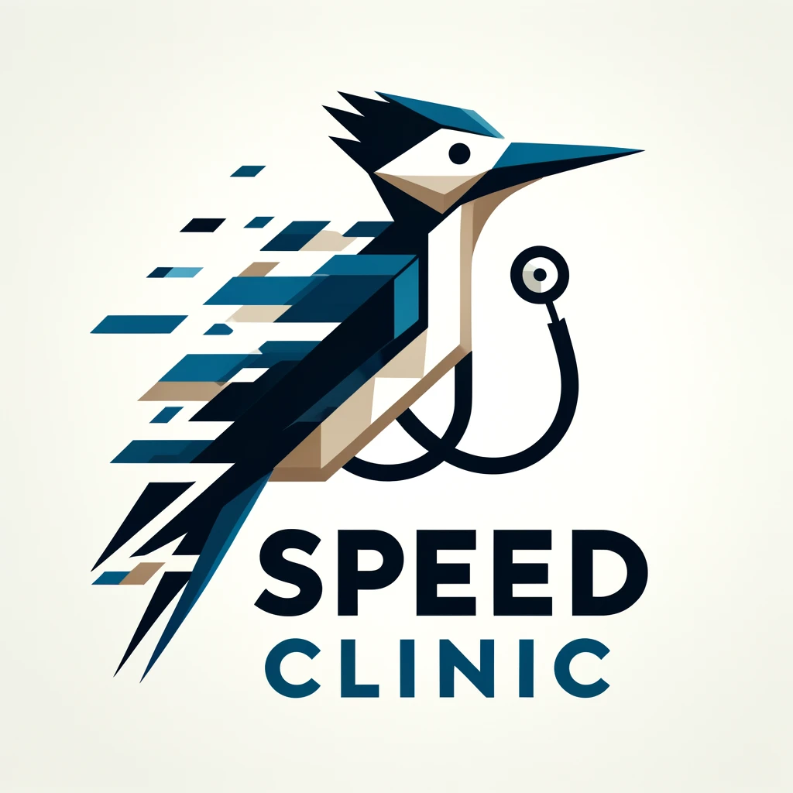
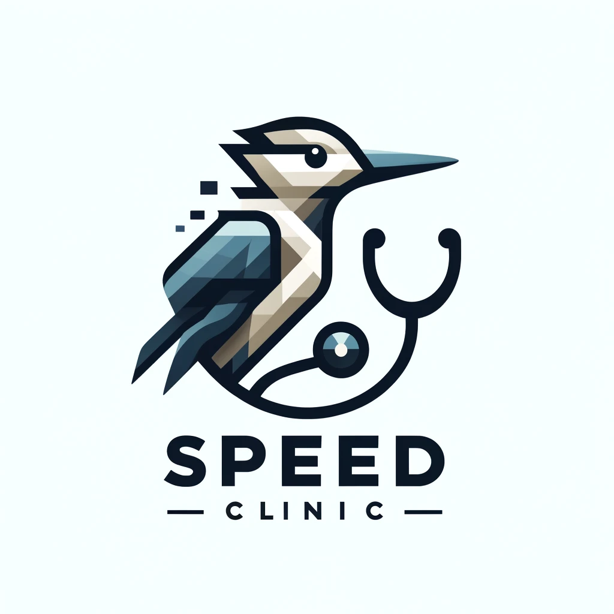
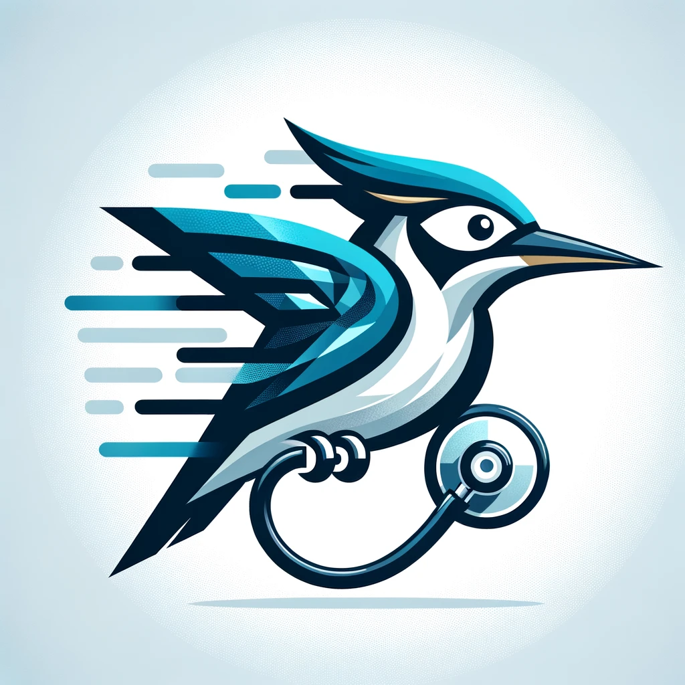
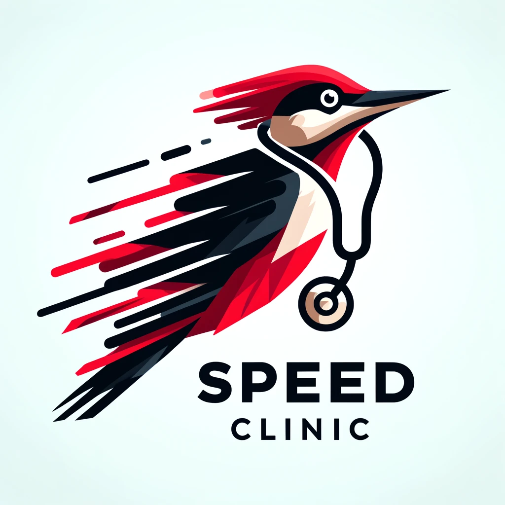
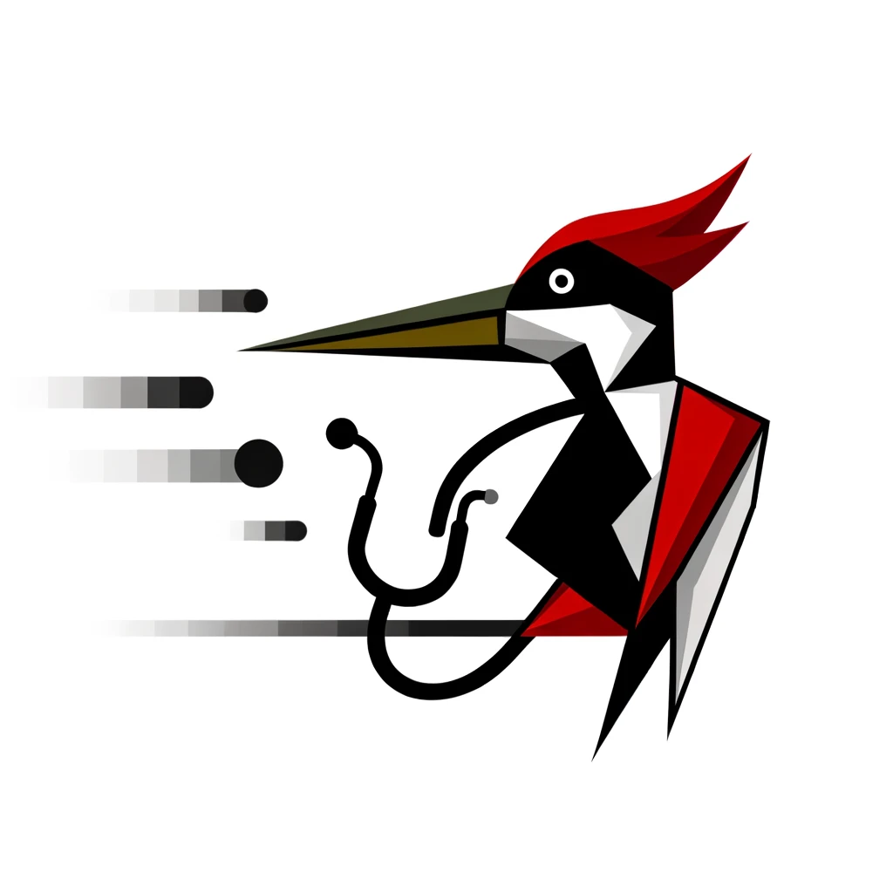
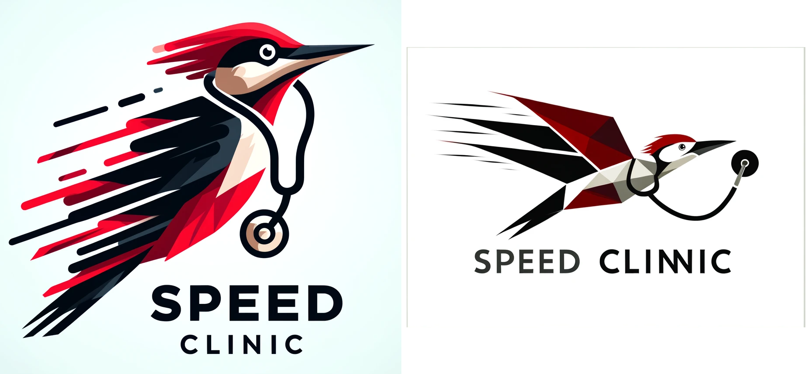

# How to make a good logo

Key qualities you should aspire to in your tech startup logo:

- Relevance: Your logo’s visual language should be a representation of your business offer. 
- Distinctiveness: A logo that is unique and differentiated from the competition creates a stronger visual impact, helping your business stand out.
- Simplicity: The simpler the logo, the more memorable it will be. While it can be tempting to go in-depth about all of your startup’s different services and nuances, it’s better to encapsulate a single, well-defined idea.
- Scalability: Your logo should look its best on every possible medium, both digital and physical. From desktop to mobile, and from billboards to business cards, ensure that your logo is versatile and fitting for all sizes and applications.

## My chat gpt prompts
Generate a simple logo for company speed clinic.

This is a software house company that gives remedy for its patients (clients) problems with software. It targets industry. It seeks to help factories to automate their processes with software. 

The logo should imply speed with some fast bird, that can wear a medical symbol (stetoscope, medical hat or  medical apron).

The logo should be simple and modern.  With modern typography. Logo should be also scalable.

[Result image, which I will not show xd]

make it simpler, the bird should be woodpecker, get rid of medical hat, leave the stetoscope, make bird to be more in motion

This was nice. Can you make it more in kubism style?

Wow, impressive. I would you to make it again with the same requirements. Just give it another try :)

And again, focus more on speed!

This one is bad. Just TOMGAY makes it funny xdd

Now the bird is less "lean", make it more lean

This is what I really like, we are close. The last adjustments are about colors (make it more woodpecker-like) and the size. Now it is square, but i want to show the speed with a shape that has more width than height (in ratio 2 to 1)

Give it another try:

# Result

If you ask me I would like to have something between this two options. 

- Left:

  - Good
    - VIvidness of the colors, gradients etc.
    - Air flow lines

  - Bad
    - Position (the tilt/lean of the bird)

- Right

  - Good
    - Position
    - The text with double NN makes it ever more speed
    - Simplicity on the perfect level 
  - Bad
    - colors

- Both
  - Good
    - modern look
  - Bad
    - position of the 
    - typography, especially in the left one
