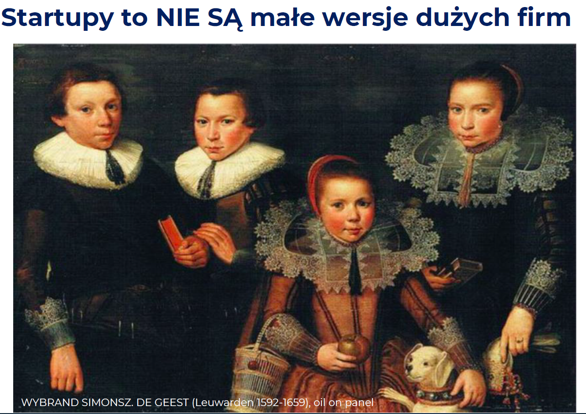

# Wyk 1

## Myślenie efektuacyjne

Metafora kucharska. Gdy pytanie w domu pada "co dziś na obiad". To normalny człowiek pomyślałby - o to zróbmy pizze albo ratatouille, albo ziemniak z sosem albo coś tam. Pomyślałby o tym co chce. Czyste abstrakcyjne pragnienie. A przedsiębiorca otwiera lodówkę, patrzy co jest i na tej podstawie kreuje plan "Ok, z tych składników co mamy możemy zrobić to to to, albo ewentualnie dokupimy jeszcze tylko to i mamy takie danie". 

**Metafora kucharska:** zamiast stawiać cele (co na obiad?), badam zasoby i w ich funkcji realizuję działania (mam mąkę, to zrobię pizzę albo naleśniki )

Myśląc efektuacyjnie:

- generujemy rozwiązania spełniające ograniczenia, zamiast szukać optymalne (które są często niemożliwe i to nas blokuje)
- przekształcają propozycje typu "pod warunkiem że" (as-if) w propozycje typu: „skoro, więc” (even-if)

## Startup - defka

Startup - jest to organizacja, która wprowadza w świat trochę innowacyjności oraz poszukuje rentownego modelu biznesowego

Jakie one są te startupy?

- **tymczasowe** -  celem startupu jest przetestowanie czegoś i przekształcenie się albo w normalną firmę albo w trupa. W firmę - no to spoko, świat chce tego co przetestowaliśmy podczas fazy startup. W trupa - no trudno, zrobiliśmy coś co nie pasuje do świata, może i ludzie potrzebują, ale nie da się wymyśleć tak, żeby samo się utrzymało.
- **innowacyjne** - startup musi dawać "coś nowego" klientom. Musi być innowacyjny. Skoro zaczynasz "od zera" (jesteś nową organizacją, nie koniecznie, że bez kasy) to w żaden inny sposób nie zaistniejesz na rynku. Z drugiej strony pamiętaj, że "coś nowego" to nie oznacza nie wiadomo jaki przeskok technologiczny. Jeżeli czegoś nie ma na rynku, to widocznie nikt tego nie potrzebuje. Bardzo ciężko jest być pierwszym na rynku (Rayban case). Zazwyczaj najbardziej innowacyjne firmy (najbardziej odstające w swojej pierwszości na rynku) karmą te następne (Rayban case). Iphone technologicznie już istniał, tam nie ma nic nowego (WPAM), koncept na system, ikonki to też już było, ktoś (Steve Jobs) po prostu to zebrał do kupy i dodał małe value i dobrze zmarketingował https://youtu.be/MnrJzXM7a6o?si=3cpiTwW3asYBXQRX). 
- **ambitne** - think big, albo Twój startup zamieni się w Unicorn albo sprzedasz go do wielkiego korpo
- **szczupłe** - Jednym z podstawowych praw ekonomii jest to, że zasoby są ograniczone (stąd cała potrzeba na pieniądz i ekonomia w ogóle). No a statrupy w szczególności mają tych zasobów mało, więc mają duże ograniczenia. Muszą wybierać, muszą używać substytuty itd.

## Po co ludzie je robią

- startupy dla startupów - tzw. Polowanie na jednorożce. **Unicorn** - firma prywatna, która wyceniona jest na "ja nie wiem ten miliard to już chyba jest nieaktualne, powinni to zwiększyć". Czyli Twoim celem jest stworzenie wielkiej firmy.
- startupy dla korporacji - tzw. **born to flip**. Tworzymy tylko taki "nośnik innowacji" i czekamy aż jakaś większa ryba kupi go od nas. Odbywa się wtedy tzw. **exit** - spieniężamy się i wychodzimy.

> "Gdy robicie jakieś przedsięwzięcie to licz sobie ile w tym czasie na adekwatnym stanowisku w korpo byś zarobił. To pozwala wyceniać startupy przed takowym exitem."
>
> 

Osoby, które "**dowożą sukces**" to są zróżnicowane w kompetencji zespoły, w odróżnieniu od osób założycielskich, które są mocno techniczne. Musisz albo szybko samemu dokształcić się w biznes, albo w miarę szybko znaleźć kogoś.

"Najpierw sprawdzimy się w Polsce, a potem pójdziemy za granicę" - nigdy tak nie mów, to jest zły mit. Najlepiej robić od razu na rynek globalny. 

# Wyk 2

## Lean Startup

https://hbr.org/2013/05/why-the-lean-start-up-changes-everything

Lean Startup - metoda tworzenia i zarządzania startupem podczas fazy rozwoju produktu poprzez eksperymentowanie, testowanie i iterowanie podczas rozwoju produktu bazując na własnych spostrzeżeniach lub feedbacku klientów.

Składowe metodyki:

Modelowanie biznesowe - startup nie ma czegoś takiego jak Business Plan, Ty modelujesz biznes tak długo, aż zatrybi. 

Odkrywanie konsumentów - najważniejszy w biznesie jest klient

Zwinny rozwój produktu - znasz to dobrze z Agile, Scrum.

Zaraz więcej o składowych tego podejścia.

## Schemat procesu budowania startupu wg Steve'a Blanka 

Przypominamy defke startupu: tymczasowa organizacja która poszukuje rentownego modelu biznesowego. Stąd pierwszy krok nazwano *Poszukiwanie*, a na schemacie pokazano jego jedną iterację. Gdy faza poszukiwania się zakończy, znajdziemy model biznesowy to przedsiębiorca nagle sobie myśli "o, kilk, działa, od tego momentu to już jest przewidywalne" i wtedy startup staje się firmą.

Na początku jest pomysł - na tym etapie wiemy co chcemy sprzedawać (mamy fajny nowy produkt) ale nie bardzo wiemy komu go sprzedawać, lub wiemy czyj problem chcemy rozwiązać (czyli wiemy kto klient), ale jeszcze nie mamy produktu, który idealnie ten problem adresuje.

> Przykład Audioteka: Założyciel Marcin Beme w 2008 roku wiedział, że audiobooki to jest przyszłość. Miał produkt, ale nie do końca jeszcze wiedział komu chce go sprzedać. Założył, że czytaczami są (a więc i też słuchaczami będą) w Polsce głównie dzieci. Cały marketing, więc skierował do matek tych dzieci. 

Punkt wyjścia to zawsze klient, nieważne czy zaczniemy od klienta czy produktu, to i tak dalsza praca polega na poznaniu klienta, bo nawet jeśli mamy już klienta, to szukamy produktu, który jak najlepiej rozwiąże jego problem, czyli tak naprawdę musimy idealnie poznać problem, czyli klienta. Dlatego mamy w pierwszym kółku "Odkrywanie klienta", stawiamy hipotezę kto to może być, jaki on jest ten klient (wiele cech), potem jak już znajdziemy do kogo uderzać z marketingiem to mamy weryfikacje hipotez biznesowych. Czy ten klient, który chce od nas kupować, to rzeczywiście jest taki jak nam się na początku wydawał i w związku z tym czy dobrze celujemy z marketingiem. Taki powrotów do punktu wyjścia, totalnych zmian wyznawanych wartości, czyli  **pivotów** może być kilka. 

No i w końcu znajdziemy tego swojego idealnego klienta. Czyli trafimy do niego z idealnym rozwiązaniem problemu czyli produktem . Teraz co potrzeba to jeszcze mieć dobry model biznesowy do tego. A jak już nam się uda być rentownym no to zamieniamy się w zwykłą firmę. 

## Koszty stałe vs Koszty zmienne

**Koszty stałe** - to takie, które nie zależą od wielkości produkcji, ponosimy je non-stop - stale. Są bardzo przewidywalne.

**Koszty zmienne** - zależą od wielkości produkcji

Gdzie wolimy przenosić swoje koszty jako przedsiębiorca? 

Oczywiście, że do kosztów zmiennych - nie sprzedaje, nie mam kosztów, sprzedaje, mam. Sprzedam więcej, koszty wzrosną, ale też jak sprzedam mniej to spadną. Zobacz kto wygrał w covid? No, ten kto nie miał kosztów, mógł zafreezować się na chwilę. Racjonalne jest zatem, że dążymy, aby przenieść swoje koszty na zmienne.

## Rolls-Royce

https://core.ac.uk/download/pdf/30625023.pdf

Rolls Royce jest firmą robiącą silniki do samolotów. Pewnego dnia zdarzyła się u nich niesamowita rewolucja, która niesamowicie podniosła im sprzedaż oraz zrewolucjonizowała świat pod pewnym względem. Dział sales wpadł na pomysł, aby od teraz nie sprzedawać firmom w całości silników, tylko klient będzie płacił za każdą godzinę jaką ten silnik robi w powietrzu. 

Ty sobie myślisz, że to przecież dobrze Ci znany model subskrypcyjny. Ale wtedy to było nowe (oraz nazywane power-by-the-hour, Product-as-a-Service, Servization), oraz za wytłumaczę Ci czemu TO JE DOBRE.

Otóż tutaj Rolls-Royce zaoferował swoim klientom pewną ukrytą wartość jaką było <u>przeniesienie ich kosztów do kosztów zmiennych</u>. Dlatego właśnie to był mega dobry ruch i zwiększył im sprzedaż, że hej. Oni popatrzyli o co tak naprawdę chodzi ich klientom. Oni po prostu chcą, żeby im samoloty latały. Żeby mogli sprzedawać loty. A nie "chciałbym, żeby moje samoloty miały silnik".

Kolejną ciekawą rzeczą o tej firmie jest to, że (no bo wiesz ekspansja firmy to skalowanie bazy klientów, (w tym liczenie tego samego dwa razy) zauważyli, że fajnie będzie też serwisować te silniki samemu i w ten o to sposób jako service przenieśli duży procent swoich przychodów.

Dygresja Outsourcing:

Wadą jego jest to, że tracisz holistyczny pogląd na całą firmę, proces i nie zauważysz miejsca na innowacje, optymalizacje, zbyt dużo black-boxów. Z drugiej strony jest lepsza efektywność kosztowa. No i tu odwieczna zasada złotego środka...

## Model biznesowy

"Sztuką i przewagą w każdej dziedzinie jest zawsze dobór odpowiednich narzędzi" - mój stary.

Model biznesowy jest to narzędzie zarządzania.

https://www.strategyzer.com - dobry model biznesowy firmy consultingowej.

W 90's wybucha bańka dotcom. Świat opanowują nowe technologie, obecna nauka o zarządzaniu próbuje ogarnąć to tymi samymi narzędziami co były znane wcześniej, czyli stary niedobry business plan. Okazuje się, że słabo działa i potrzeba czegoś nowego, nowej teorii i to nowe to **business model**.

Czymże jest więc model biznesowy?

Głównym celem jest przekształcenie pomysłu w przedsięwzięcie. Model biznesowy, więc mówi jak przekształcić założenia (hipotezy biznesowe) w fakty. Model biznesowy w ogóle nie mówi o produkcie, mówi o wartości dla klienta.

**Model biznesowy** - opisuje sposób w jaki organizacja TWORZY i DOSTARCZA WARTOŚĆ dla KLIENTA, oraz jak na tym ZARABIA.

https://businessmodelnavigator.com --> Tu możesz sobie zobaczyć różne modele eksplorować je i są przykłady. 

Narzędzia na STUP to właśnie są takie i po to, żeby ten wykres jak najszybciej wyprostować.

Alex Ostelvander postawił sobie za cel zwizualizować model biznesowy. https://www.ted.com/talks/alex_osterwalder_a_blueprint_for_entrepreneurship

I mu wyszło takie o:

Każde z tych pól może być źródłem **innowacyjności**, czyli po prostu wprowadzeniem czegoś nowego.

Możemy tu wyróżnić 3 sekcje:

Zółta - frontstage. Cała interakcja z klientem. 

Niebieska - backstage. To co robię w firmie sam.

Zielona - wgląd w oba pozostałe pola. Model przychodowy.