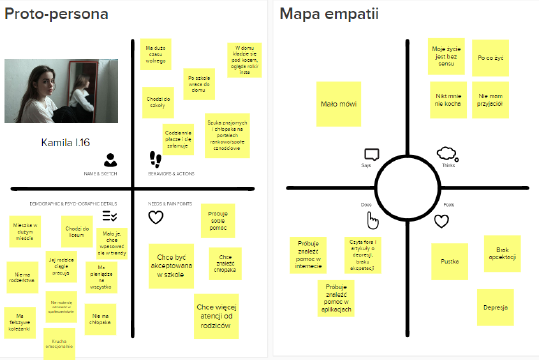

# Wyk 1

## Myślenie efektuacyjne

Metafora kucharska. Gdy pytanie w domu pada "co dziś na obiad". To normalny człowiek pomyślałby - o to zróbmy pizze albo ratatouille, albo ziemniak z sosem albo coś tam. Pomyślałby o tym co chce. Czyste abstrakcyjne pragnienie. A przedsiębiorca otwiera lodówkę, patrzy co jest i na tej podstawie kreuje plan "Ok, z tych składników co mamy możemy zrobić to to to, albo ewentualnie dokupimy jeszcze tylko to i mamy takie danie". 

**Metafora kucharska:** zamiast stawiać cele (co na obiad?), badam zasoby i w ich funkcji realizuję działania (mam mąkę, to zrobię pizzę albo naleśniki )

Myśląc efektuacyjnie:

- generujemy rozwiązania spełniające ograniczenia, zamiast szukać optymalne (które są często niemożliwe i to nas blokuje)
- przekształcają propozycje typu "pod warunkiem że" (as-if) w propozycje typu: „skoro, więc” (even-if)

## Startup - defka

Startup - jest to organizacja, która wprowadza w świat trochę innowacyjności oraz poszukuje rentownego modelu biznesowego

Jakie one są te startupy?

- **tymczasowe** -  celem startupu jest przetestowanie czegoś i przekształcenie się albo w normalną firmę albo w trupa. W firmę - no to spoko, świat chce tego co przetestowaliśmy podczas fazy startup. W trupa - no trudno, zrobiliśmy coś co nie pasuje do świata, może i ludzie potrzebują, ale nie da się wymyśleć tak, żeby samo się utrzymało.
- **innowacyjne** - startup musi dawać "coś nowego" klientom. Musi być innowacyjny. Skoro zaczynasz "od zera" (jesteś nową organizacją, nie koniecznie, że bez kasy) to w żaden inny sposób nie zaistniejesz na rynku. Z drugiej strony pamiętaj, że "coś nowego" to nie oznacza nie wiadomo jaki przeskok technologiczny. Jeżeli czegoś nie ma na rynku, to widocznie nikt tego nie potrzebuje. Bardzo ciężko jest być pierwszym na rynku (Rayban case). Zazwyczaj najbardziej innowacyjne firmy (najbardziej odstające w swojej pierwszości na rynku) karmą te następne (Rayban case). Iphone technologicznie już istniał, tam nie ma nic nowego (WPAM), koncept na system, ikonki to też już było, ktoś (Steve Jobs) po prostu to zebrał do kupy i dodał małe value i dobrze zmarketingował https://youtu.be/MnrJzXM7a6o?si=3cpiTwW3asYBXQRX). 
- **ambitne** - think big, albo Twój startup zamieni się w Unicorn albo sprzedasz go do wielkiego korpo
- **szczupłe** - Jednym z podstawowych praw ekonomii jest to, że zasoby są ograniczone (stąd cała potrzeba na pieniądz i ekonomia w ogóle). No a statrupy w szczególności mają tych zasobów mało, więc mają duże ograniczenia. Muszą wybierać, muszą używać substytuty itd.

## Po co ludzie je robią

- startupy dla startupów - tzw. Polowanie na jednorożce. **Unicorn** - firma prywatna, która wyceniona jest na "ja nie wiem ten miliard to już chyba jest nieaktualne, powinni to zwiększyć". Czyli Twoim celem jest stworzenie wielkiej firmy.
- startupy dla korporacji - tzw. **born to flip**. Tworzymy tylko taki "nośnik innowacji" i czekamy aż jakaś większa ryba kupi go od nas. Odbywa się wtedy tzw. **exit** - spieniężamy się i wychodzimy.

> "Gdy robicie jakieś przedsięwzięcie to licz sobie ile w tym czasie na adekwatnym stanowisku w korpo byś zarobił. To pozwala wyceniać startupy przed takowym exitem."
>
> 

Osoby, które "**dowożą sukces**" to są zróżnicowane w kompetencji zespoły, w odróżnieniu od osób założycielskich, które są mocno techniczne. Musisz albo szybko samemu dokształcić się w biznes, albo w miarę szybko znaleźć kogoś.

"Najpierw sprawdzimy się w Polsce, a potem pójdziemy za granicę" - nigdy tak nie mów, to jest zły mit. Najlepiej robić od razu na rynek globalny. 

# Wyk 2

## Lean Startup

https://hbr.org/2013/05/why-the-lean-start-up-changes-everything

Lean Startup - metoda tworzenia i zarządzania startupem podczas fazy rozwoju produktu poprzez eksperymentowanie, testowanie i iterowanie podczas rozwoju produktu bazując na własnych spostrzeżeniach lub feedbacku klientów.

Składowe metodyki:

Modelowanie biznesowe - startup nie ma czegoś takiego jak Business Plan, Ty modelujesz biznes tak długo, aż zatrybi. 

Odkrywanie konsumentów - najważniejszy w biznesie jest klient

Zwinny rozwój produktu - znasz to dobrze z Agile, Scrum.

Zaraz więcej o składowych tego podejścia.

## Schemat procesu budowania startupu wg Steve'a Blanka 

Przypominamy defke startupu: tymczasowa organizacja która poszukuje rentownego modelu biznesowego. Stąd pierwszy krok nazwano *Poszukiwanie*, a na schemacie pokazano jego jedną iterację. Gdy faza poszukiwania się zakończy, znajdziemy model biznesowy to przedsiębiorca nagle sobie myśli "o, kilk, działa, od tego momentu to już jest przewidywalne" i wtedy startup staje się firmą.

Na początku jest pomysł - na tym etapie wiemy co chcemy sprzedawać (mamy fajny nowy produkt) ale nie bardzo wiemy komu go sprzedawać, lub wiemy czyj problem chcemy rozwiązać (czyli wiemy kto klient), ale jeszcze nie mamy produktu, który idealnie ten problem adresuje.

> Przykład Audioteka: Założyciel Marcin Beme w 2008 roku wiedział, że audiobooki to jest przyszłość. Miał produkt, ale nie do końca jeszcze wiedział komu chce go sprzedać. Założył, że czytaczami są (a więc i też słuchaczami będą) w Polsce głównie dzieci. Cały marketing, więc skierował do matek tych dzieci. 

Punkt wyjścia to zawsze klient, nieważne czy zaczniemy od klienta czy produktu, to i tak dalsza praca polega na poznaniu klienta, bo nawet jeśli mamy już klienta, to szukamy produktu, który jak najlepiej rozwiąże jego problem, czyli tak naprawdę musimy idealnie poznać problem, czyli klienta. Dlatego mamy w pierwszym kółku "Odkrywanie klienta", stawiamy hipotezę kto to może być, jaki on jest ten klient (wiele cech), potem jak już znajdziemy do kogo uderzać z marketingiem to mamy weryfikacje hipotez biznesowych. Czy ten klient, który chce od nas kupować, to rzeczywiście jest taki jak nam się na początku wydawał i w związku z tym czy dobrze celujemy z marketingiem. Taki powrotów do punktu wyjścia, totalnych zmian wyznawanych wartości, czyli  **pivotów** może być kilka. 

No i w końcu znajdziemy tego swojego idealnego klienta. Czyli trafimy do niego z idealnym rozwiązaniem problemu czyli produktem . Teraz co potrzeba to jeszcze mieć dobry model biznesowy do tego. A jak już nam się uda być rentownym no to zamieniamy się w zwykłą firmę. 

## Koszty stałe vs Koszty zmienne

**Koszty stałe** - to takie, które nie zależą od wielkości produkcji, ponosimy je non-stop - stale. Są bardzo przewidywalne.

**Koszty zmienne** - zależą od wielkości produkcji

Gdzie wolimy przenosić swoje koszty jako przedsiębiorca? 

Oczywiście, że do kosztów zmiennych - nie sprzedaje, nie mam kosztów, sprzedaje, mam. Sprzedam więcej, koszty wzrosną, ale też jak sprzedam mniej to spadną. Zobacz kto wygrał w covid? No, ten kto nie miał kosztów, mógł zafreezować się na chwilę. Racjonalne jest zatem, że dążymy, aby przenieść swoje koszty na zmienne.

## Rolls-Royce

https://core.ac.uk/download/pdf/30625023.pdf

Rolls Royce jest firmą robiącą silniki do samolotów. Pewnego dnia zdarzyła się u nich niesamowita rewolucja, która niesamowicie podniosła im sprzedaż oraz zrewolucjonizowała świat pod pewnym względem. Dział sales wpadł na pomysł, aby od teraz nie sprzedawać firmom w całości silników, tylko klient będzie płacił za każdą godzinę jaką ten silnik robi w powietrzu. 

Ty sobie myślisz, że to przecież dobrze Ci znany model subskrypcyjny. Ale wtedy to było nowe (oraz nazywane power-by-the-hour, Product-as-a-Service, Servization), oraz za wytłumaczę Ci czemu TO JE DOBRE.

Otóż tutaj Rolls-Royce zaoferował swoim klientom pewną ukrytą wartość jaką było <u>przeniesienie ich kosztów do kosztów zmiennych</u>. Dlatego właśnie to był mega dobry ruch i zwiększył im sprzedaż, że hej. Oni popatrzyli o co tak naprawdę chodzi ich klientom. Oni po prostu chcą, żeby im samoloty latały. Żeby mogli sprzedawać loty. A nie "chciałbym, żeby moje samoloty miały silnik".

Kolejną ciekawą rzeczą o tej firmie jest to, że (no bo wiesz ekspansja firmy to skalowanie bazy klientów, (w tym liczenie tego samego dwa razy) zauważyli, że fajnie będzie też serwisować te silniki samemu i w ten o to sposób jako service przenieśli duży procent swoich przychodów.

Dygresja Outsourcing:

Wadą jego jest to, że tracisz holistyczny pogląd na całą firmę, proces i nie zauważysz miejsca na innowacje, optymalizacje, zbyt dużo black-boxów. Z drugiej strony jest lepsza efektywność kosztowa. No i tu odwieczna zasada złotego środka...

## Model biznesowy

"Sztuką i przewagą w każdej dziedzinie jest zawsze dobór odpowiednich narzędzi" - mój stary.

Model biznesowy jest to narzędzie zarządzania.

https://www.strategyzer.com - dobry model biznesowy firmy consultingowej.

W 90's wybucha bańka dotcom. Świat opanowują nowe technologie, obecna nauka o zarządzaniu próbuje ogarnąć to tymi samymi narzędziami co były znane wcześniej, czyli stary niedobry business plan. Okazuje się, że słabo działa i potrzeba czegoś nowego, nowej teorii i to nowe to **business model**.

Czymże jest więc model biznesowy?

Głównym celem jest przekształcenie pomysłu w przedsięwzięcie. Model biznesowy, więc mówi jak przekształcić założenia (hipotezy biznesowe) w fakty. Model biznesowy w ogóle nie mówi o produkcie, mówi o wartości dla klienta.

**Model biznesowy** - opisuje sposób w jaki organizacja TWORZY i DOSTARCZA WARTOŚĆ dla KLIENTA, oraz jak na tym ZARABIA.

https://businessmodelnavigator.com --> Tu możesz sobie zobaczyć różne modele eksplorować je i są przykłady. 

Narzędzia na STUP to właśnie są takie i po to, żeby ten wykres jak najszybciej wyprostować.

Alex Ostelvander postawił sobie za cel zwizualizować model biznesowy. https://www.ted.com/talks/alex_osterwalder_a_blueprint_for_entrepreneurship

I mu wyszło takie o:

Każde z tych pól może być źródłem **innowacyjności**, czyli po prostu wprowadzeniem czegoś nowego.

Możemy tu wyróżnić 3 sekcje:

Zółta - frontstage. Cała interakcja z klientem. 

Niebieska - backstage. To co robię w firmie sam. 

Zielona - wgląd w oba pozostałe pola. Model przychodowy.

# Wyk 3

## The Business Model Canvas

Każde pole poniżej może być źródłem innowacji. Tzn nie zawsze innowacja musi być związana bezpośrednio z technologią, może to być nowe podejście do czegoś.

https://www.slideshare.net/sblank/nsf-online-lecture-5-customer-relationships

Niebieskie - Tu firmy najchętniej budują przewagę ponieważ tu mają największą kontrolę. Zasoby intelektualne to też np. patenty. Dużo ma Dyson (żeby być unique, dużo ma ich Nokia, żeby robić lease).

Zielone - model finansowy. Tu się zastanawiamy co generuje koszty u nas. Jeśli jesteśmy Dyson to będziemy mieć koszty głównie w R&D. Jeśli chcemy budować markę Tesli, czyli na rynku już bardzo starym i osiadłym to wiadomix, że na marketing muszą iść grube miliony.

Zółte

Jak przedsiębiorca wstaje rano to czym się zajmuje? Są dwa podstawowe działania:

- budowanie produktu
- pozyskanie klienta

**Partnerstwa** są spoko. One z definicji są takie, że obie strony mają win/win. Podwykonawstwo to nie jest partnerstwo. Ciężko mieć partnertwo korpo z niekorpo, średnia firma z nieśrednia, startup z ~startup. https://www.stava.eu/pl/. Zobacz ta firma nie ma napisane - dowoziomy żarcie do domu, ona oferuje innym firmom partnerstwo.

>  Już lepiej zrobić kilka modeli niż jeden naćkany, a potem je skleić.

### Lejek konwersji

**Lejek** ponieważ część wpada do niego (trafiasz do nich ze swoich marketingiem), ale nie każdy z niego wypada (nie pójdzie dalej w to). Idealny kształt lejka to prostokąt, co przekłada się na to, że robisz reach-out tylko do takich ludzi, którzy coś od Ciebie kupią. Z drugiej strony też jest lejek, ponieważ teraz tych ludzi co zostali/przeszli dalej używasz, aby zdobyć kolejnych klientów.

CAC - Customer Aquisition Cost

Generować dobre leady - wpuszczać, naganiać takich ludzi, u których jest największe pstwo na **konwersję** na klienta, nie strzelać na ślepo.

### Kto jest dobry w co

Key partners - IKEA - z kim ona ma to partnertswo? Z Tobą jako klientem. Oni oddali składanie swoich mebli nie do jakiejś firmy zewnętrznej tylko do Ciebie :smirk:

Customer Relationship - Firmy, które stawiają wysokie mury i zamykają klienta w swoich ekosystemach, tak aby nie chciało mu się wychodzić.

### Typowe błędy w modelowaniu biznesowym

1. Model jest na krótko, jest dynamiczny, bo świat jest dynamiczny. Model może zmieniać się codziennie, może iterować.
2. Równolegle oprócz modelowania musimy weryfikować kolejne wersje prototypu produktu (najlepiej z klientem), czy to co zakładaliśmy, rzeczywiście jest prawdą (np. Audioteka case)
3. As above
4. Odnośnie klienta
   1. Definiowanie klienta jako każdy/wszyscy - nigdy tak nie jest. Zawsze da się wyspecyfikować dokładniej persone. Myślisz, że messenger jest dla każdego? Że tu klient to każdy? To czemu nie ma 7B users?
   2. Mylenie klient z użytkownik. Ja jestem użytkownikiem strony facebook.com, ale wgl za jej design w html ie płaciłem.
   3. B2C jest dużo trudniejszym rynkiem
5. Załóżmy software, który optymalizuje/automatyzuje procesy jakieś w firmie. Ten software to jest produkt, ale wartość jaką oferujemy to obniżenie kosztów tego procesu, skrócenie czasu jego obsługi itd.
6. Czyli co jest mostem między Twoim produktem, a klientem
7. Lejek
8. Czyli jakaś symbioza dwóch firm fajna
9. Nie umiem jeszcze tego skomentować
10. Nie umiem ... as above

### Lean canvas

To jest narzędzie do modelowania biznesowego. Alternatywa (aczkolwiek podobne) do Business Model Canvas.

Dobrze mieć zdefiniowane kryteria porażki, bo często i z reguły agonie się niepotrzebnie przedłużają.

## Lean Startup - narzędzia

Model biznesowy to jest ukorowanie pracy nad projektem, nikt nie oczekuje, że z palca od razu na niego wpadniesz. Ale jak to JPII mówił WYMAGAJ OD SIEBIE CHOĆBY INNI NIE WYMAGALI KURWA I JEST JECHANE, tak więc oczekujemy, że użyjesz tych narzędzi, aby jak najszybciej wpaść na model.

### CPS - Client - Problem - Solution

To sobie rozpisz, żeby już na etapie problemu móc odrzucić pomysły. Odróżnienie co rokuje a co nie.

> Fundusze inwestycyjne, które słuchają tych prezentacji, to one też nie wiedzą co rokuje a co nie. Tu jest dużo gry w ciemno. 
>
> Ogólnie to na 10 zainwestowanych startupów przez VC 1 spłaca całą resztę.
>
> Jak usłyszysz, że 9 na 10 startupów upada, to nie -> to, to poprzednie zdanie jest true.

### Proto-Persona

https://flyingbisons.com/knowledge-base/proto-persona

### Empathy Map

Idzie dobrze w parze z Proto-Persona

### The value Proposition Canvas

[The Value Proposition Canvas example on Tesla case](https://youtu.be/zlf2iRRufGE?si=DZGVyOIq66Swuk_8) <-- Prowadzi Alex Ostelvander.

https://www.strategyzer.com/library/the-value-proposition-canvas

### Strategyzer  - Business Model Canvas

To jest tool ostateczny

https://www.strategyzer.com/library/the-business-model-canvas

### Lean Canvas

To jest tool poboczny/ostateczny

https://bmtoolbox.net/tools/lean-canvas/

# Wyk 4

Hasło przewodnie tego wykładu to:

"Innowacje i zmiany mogą się wydarzyć w każdy z 3-ech/9-ciu bloków/pól modelu biznesowego"

Warto się zatem zastanowić co w NASZEJ firmie będzie wyróżnikiem.

> Gdzie jest duża rotacja pracowników? Duży handel (biedronka) oraz szkoły językowe.

>Value proposition to też korzyści marketingowe, wizerunkowe, emocjonalne, społeczne.

> Pola w kanwie jedne wynikają z drugich. Masz w Key Resources, że potrzeba Ci know-how, to Key-Partners będą klienci dzielący się wiedzą, to Key-Activities będzie pozyskanie partnerów.

**Sprzedaż bezpośrednia** - czyli takie chodzenie, nękanie ludzi. Wybierasz jakiś sektor np. banki. Szukasz jednego CEO idziesz do niego i tak go urabiasz aż kupi, a potem to on poleci znajomemu z branży i się to kręci

## Zmiany w frontstage

### Nowe rynki

Wizjonerzy adresują rynki:

- nowe
- nienowe, ale takie, gdzie jakaś potrzeba jeszcze nie jest addressed, lub jest addressed, ale po staremu i technologia pozwala na taką adresjaće, która da gain na innym polu
- totalnie specyficzne
- które JESZCZE nie istnieją
- demokratyzacja
  - Demokratyzacja w modelu biznesowym odnosi się do procesu, w którym firma stara się uczynić swoje produkty, usługi lub technologie bardziej dostępnymi i przystępnymi dla szerszego grona osób. Oznacza to zazwyczaj obniżenie kosztów, uproszczenie procesów lub zmniejszenie barier wejścia, aby umożliwić większej liczbie ludzi korzystanie z oferowanych rozwiązań. Przykłady demokratyzacji w modelu biznesowym obejmują: 
    - Obniżenie cen: Firmy mogą zmniejszyć ceny swoich produktów lub usług, aby uczynić je bardziej dostępnymi dla osób o różnych poziomach dochodów. 
    - Uproszczenie interfejsu użytkownika: Poprzez usprawnienie interfejsu użytkownika lub zapewnienie łatwiejszego dostępu do produktów/usług, firmy mogą zwiększyć dostępność dla osób o różnych poziomach umiejętności technicznych. 
    - Otwarte standardy: Stworzenie otwartych standardów lub protokołów może umożliwić innym firmom dostosowanie się do danej branży lub tworzenie kompatybilnych produktów, co przyczynia się do większej konkurencji i różnorodności oferty na rynku. 
    - Edukacja i szkolenia: Dostarczenie darmowych lub tanich zasobów edukacyjnych oraz szkoleń może pomóc zwiększyć umiejętności i wiedzę osób z różnych środowisk, umożliwiając im lepsze wykorzystanie nowych technologii czy możliwości biznesowych. D
    - Demokratyzacja w modelu biznesowym ma na celu nie tylko zwiększenie dostępu do produktów i usług, ale także promowanie inkluzji społecznej oraz stymulowanie innowacji poprzez zachęcanie większej liczby osób do udziału w życiu gospodarczym i społecznym.

### Kanały

Nespresso był pionierem sprzedaży kawy bezpośrednio do klienta. Eliminacja pośrednika - sklep. To wymagało nowych zasobów - większej wiedzy o kliencie, sposoby na dotarcie do klienta.

### Grawitacja

Repurposer tu chyba jest, ale nie wiem.

Np. był soft dla projektowania myśliwców, a się okazuje, że architekcji mogą z nań korzystać.

### Przykłady

#### Wizjoner: Tesla

W 2012 marka Tesla tworzy produkt na **rynku**, którego nikt wcześniej nie eksploatował.

#### Repurposer: M-Pesa

W 2007 r. Safaricom re-wykorzystuje swoją sieć telekomunikacyjną w Kenii do stworzenia M-Pesa-rozwiązania w zakresie masowych przelewów pieniężnych.
W 2009 r. w Kenii (populacja 39 mln) są zaledwie 352 bankomaty i 491 oddziałów banków.
W 2013 r. z sieci korzysta 23 mln Kenijczyków, a w 2019r. -37 mln.

## Zmiany w backstage

### Działania

- **efektywność** 
- **mistrz tempa** - np. Zara, wypracowała taki model, żeby móc jak najszybciej odpowiadać na trendy w modzie.
- **zrównoważenie - social impact** - tu chodzi o zrównoważony rozwój (sustainable development), np. InPost teraz tak się promuje, ponieważ ostatnia mila (która stanowi dosyć duży procent dojazdu kuriera) jest zastąpiona piechotą zamiast śladem węglowym. Tutaj też dobry przykład to firma Patagonia.

### Warownie zasobów

- **Użytkowników** - że bogate community - tak. Korzystanie z community. Produkty, gdzie jest efekt skali, im większa sieć userów, tym lepiej ona działa. Przykład: Waze
- **Platformy**
- **Intellectual Property** - tu np. Dyson. On wydaje mega dużą kasę na best class inżynierów, żeby mieć produkty totalnie wyróżniające się technologią. Ale też, żeby były one unikalne, to bardzo dużo tych technologii patentuje.
- **Marki**

### Skalujący się

- **Delegowanie**
- **Franczyzy** - McDonald's, KFC, Żabka. Tworzysz jakiś wirtualny produkt, a dajesz innym B2B jego implementacje. Ty się zajmujesz marketingiem na cały kraj itp, a oni dają dostęp klientom do Twojego produktu.
- **Licencje** - czyli, że masz jakiś produkt, i dajesz komuś innemu licencje na to, ze może on użyć tego jako cześć swojego produktu. Np. tak zrobił DigitalRoute z mega dobrą platformą co szybko gada diameter, a Broadforward ogarnął z tego PCRF.

### Przyklady

#### Waze

W 2008 roku WAZE opracowuje system nawigacji drogowej, który staje się lepszy z każdym kolejnym użytkownikiem.
Informacje przekazywane przez użytkowników w czasie rzeczywistym pomagają skrócić czas dojazdu do pracy i zmniejszyć korki.

#### Dyson

Począwszy od pierwszego odkurzacza w 1993 r., Dyson stawia czoła wielu wyzwaniom związanym z inżynierią produktów. Dużo inwestuje w Research&Development aby wprowadzać na rynek innowacyjne, najlepsze w swojej klasie produkty, które sprzedaje drogo w klasie premium i chroni patentami.

#### Zara

W latach osiemdziesiątych Zara poważnie zaburza przemysł mody, radykalnie rekonfigurując łańcuch dostaw i tworząc kategorię szybkiej mody „fast fasion”. Jest w stanie niemal natychmiast reagować na trendy w modzie poprzez pionową integrację swojego łańcucha dostaw.

#### Patagonia

W 1973 roku Yvan Chouinard tworzy firmę odzieżową, której działalność jest zorientowana na ochronę środowiska.

## Zmiany w Profit Disruption

### Kosztowcy

- **Eliminacja kosztów stałych** - czyli sprzedawanie tego co do nas nie należy: drop-shipping, AirBnb.
- **Tech-koszty**
- **Low-Cost** - np. tanie linie lotnicze (WizzAir, RyanAir, EnterAir), pojawiły się dzięki zmianom w prawie.

### Marżowcy

- **Bogate nisze high-end**
- **Głębokie nisze**

### Przychodowcy

- **Powracający przychód** - czyli, że klienci wracają (a jednocześnie dochodzą nowi) - keep&grow.
- **Komplementarne "przynęta i haczyk"** - Kodak sprzedaje tanio aparaty, a zarabia na usługach wywoływania zdjęć i ten model się sprawdzał przez kilkadziesiąt. Xerox tak samo, tanie drukarki, drogie tusze, serwis i części zamienne.
- **Freemium**
- **Sprzedaż subsydiowana**

### Przykłady:

#### What's app

Technolodzy” używają technologii w sposób, który pozwala im na uzyskanie dramatycznej zmiany w strukturze kosztów.

W 2009 WhatsApp uruchamia darmową usługę przesyłania wiadomości, która poważnie zakłóca rynek usług SMS oraz mailowych.

Dają wiadomości za darmo, jak nikt dotąd wcześniej. Skąd więc mają kase na utrzymanie? That's very easy (today) - sprzedają dane użytkowników do firm odpowiedzialnych za targetowane reklamy.

#### citizenM

Oni idealnie trafiają w rynek "Digital Nomad". Digital Nomad zazwyczaj charakteryzuje to, że sa to ludzie bogaci, którzy chcą mieszkać blisko centrum jakiegoś fajnego miasta. Chcą mieć high-end hotel. 

I właśnie  na rynku, gdzie po AirBnb i Booking.com wydawało się, że już nic się nie zadzieje, to oni zaspokajają nisze Digital Nomad. Hotele są totalnie automated, koszty ludzkie są dzieki temu zredukowane sztos, przychodzą tu tylko 1 człowiek na dyżury i ten jeden jest od wszystkiego. Ceny za takie hotele są wysokie, bo dla bogatych ludzi no i ez.

### Summary

Nie wiem ocb tutaj też mozna mieć przewagi xD

Oprzyj swój model o coś, o jedno z tych poniżej:

## Żabka

Możesz mieć tak dwie kanwy wgl

# Wyk 5

## Oburęczna organizacja (ang. Ambidextrous)

Współczesne organizacje funkcjonują w coraz bardziej niepewnym środowisku, warunkach wysokiego ryzyka. Ich przetrwanie jest ważne. Wszyscy zadają sobie pytanie - "Co zrobić, żeby przetrwać?", "Co zrobić, żeby konkurencja. której jeszcze nie widzimy jutro nas nie zjadła?". No i remedium to **exploit**, ale nie zaniedbywać równocześnie **explore**. Organizacje głowią się nad tym jak połączyć jedno z drugim.

Zoom na projekty eksploracyjne i eksploatacyjne. 

Corporate venture firmy duże tworzą w ciemno spółki córki, żeby rozwijać jakieś fajne modele biznesowe. No i jak jakiś zadziała to wdrażają to u siebie. 

Np. Siemens w takim lejku z 250 na wejściu to tylko 2 znalazły zastosowanie w firmie matce. Reszta do kosza.

Krytycy mówią na to Innovation Theater.

# Cwiczenia

## 1

Lean się wzięło od Toyoty 

### Leeeean

Działanie leanowo - działanie szczupłe - Zdroworozsądkowe podejście do usprawniania procesów poprzez eliminacje marnotrastwa i poprawę przepływu w celu dostarczenia oczekiwanej wartości klientowi oraz zwiększenia produktywności

Ekonomia wysiłku - tylko to co jest przydatne potrzebne zdroworozsądkowe. Jebać biurokracje 16:25 

Wszystko kręci się wokół klient. 

Bogaci ludzie, bogate kraje to takie które produkują dużo w jednostce czasu.

### Pitch deck

### Pay it forward

Pay it forward - kultura współpracy, pomagam komuś nie oczekuje że ktoś odwzajemni, ludzie bogaci to tacy co mocno współpracują, bogate firmy to takie co mocno współpracują, i Ty pomożesz Tobie, ktoś inny komuś innemu i tak to wraca.

STUP obrósł trochę taka przyjaźnią, jest dużo osób też z wysokich stanowisk w tej grupie przyjaciół.  Bogaci ludzie są mega bezpośredni i są np od razu na Ty.  

Aula Polska "Zdrowie Psychiczne Foundera".  

Grywalizacja to jest dobre, często to rób jako manager  

## 2

!!! Zrób kurs lean canvas na strefawiedzypfr.pl. - i dodaj go na LinkedIn.

16:23 Ash Maurya wziął od Ostelvaldera canvas i "ulepszył". Ulepszył według niego.  Ten kurs tłumaczy te 9 pól.  Wydanie III książki Asha jest najlepsze.  Gość mówi że w 2h całość jebniesz.  

Startupowcy to best książka jest. 

Teoria slotów, trzeba wejść w odpowiednim czasie, produkty albo są spóźnione, ale na rynku jest dla nich za wcześnie.  

16:56 Iceye 

> Wypełnij zajebiście LinkedIn. Spójrz na swój profil jako inwestor.  

Sunk costs - Koszty utopione. 

>  Adam Grycuk twierdzi że już CPK nie można cofnąć.  

Złe rozpoznanie rynku i konkurencji to jest main dish Twój. 

17:05 klient jest sędzią wartości 

Trzeba always dopasować obie rzeczy w zarządzaniu często jest dużo takich mnożeń 

### Rozponanie rynku

Product-market fit jest ważne. 

Ty jako inżynier widzisz swoją brożkę, a nie innych ludzi.  Stań się nimi, wejdź w ich świat. Myśl jak oni.

Jak ludzie,firmy jakoś sobie radzą w tym momencie z tym zmudnym procesem? --> **Desk research.**  

Czego użyć?

- słowa kluczowe (znajdź ich 500)
- język angielski > język polski
- google search operators
- rozmowa z ludźmi, którzy znają ten rynek
- sprawdzić miejsca, w których rozmawiają ze sobą klienci lub użytkownicy Twojego produktu
- zostać klientem konkurencji i przetestować ich rozwiązania
- Równolegle konfrontować tę rozszerzaną wiedzę o rynku, klientach, konkurentach i ich produktach ze swoim rozwiązaniem - czy dalej ma to sens?

## The startup Lexicon

Każa branża ma swój slang, founderzy też. Jest 100 słów i one są w książce 

**Founder**

**Founder-market fit** - dopasowanie foundera do rynku  To jets ważne VC często inwestuje w ludzi. Jak macie zespół to często możecie ogarnąć co jesteście mocno i to robić 

**Acqui-hiring  Acqui-hire**  Kupujemy startup nie dla rynku i produktu ale dla ludzi. 

**Exit** - sprzedaje w jakiś sposób startup, 

**Initial Public Offeration** - wejście na giełdę  

**Pitch** - czynności robienia tej prezki 

**Pitch deck** - 8 slajdów  

**Pitch** - czyli wsiadasz z gościem do windy i masz mu szybko powiedzieć. Ludzie bogaci mają mało czasu 

**Demo day** - dzień prezentacji 

**Pivot** - zmiana koncepcji, modelu biznesowego, duża poważna zmiana 

**Unicorn** - prywatną firma wyceniana na na 1mld USD. Wycena firm to ciężka sprawa, jeszcze ciężej startupy.  

**Bootstrapping** - tworzenie bez żadnego kapitału, jeśli na razie bootstrapujemy to że nie mamy finansowania zewnętrznego, swoje fundusze 

**3fs (4fs)** - founders, family, friends, (and fools) 

**VC**  

**CVC** - corporate VC, wiele wielkich firm ma swój własne fundusze VC

**Venture building** - 17:15  Żeby uzyskać technologie, kupujemy kompetencje, tak wielkie firmy robią. Ale możecie też zlecić wyhodowanie takiej firmy dla siebie, to jest venture building. Firmy które wykonują takie zlecenia nazywają się fabrykami startupow. JAK SIE NAZYWA TA W WAWIE 

**Anioł biznesu** - VC ale prywatną osobą jest 

**B2G** - business to government 

