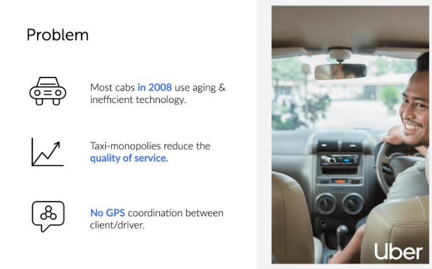

# 1 - Slajd powitalny

logo, nazwa firmy oraz produktu blu (jego logo też) i screen taki fajny softa, ze kilka tych kart tak na sobie z boku rzut

# 2 - Problem

Tu nawet nie chodzi o "opisanie" problemu tylko przedstawienie problemów obecnego rozwiązania.

Zobacz Uber pokazał problemy obecnej sytuacji na rynku "podwózek".

# 3 - Rozwiązanie

UberCab Concept : Klient ma dostęp do całego rynku, ale nie tylko do jednego usługodawcy taxi.

Automate dispatch: wcześniej taxiarz gdzie był stamtąd jechał, teraz algorytm dobiera najbliższego kierowcę.

Latest consumer web&: Ładna apka na telefon a nie jakieś numery tel

Incentivized drivers - koniec z monopolem, każdy sobie rzepke skrobie

Zauważ, że to rozwiązanie to nie jest apka. Apka to tylko enabler, jeden z elementów całej architektury. 

https://slidebean.com/templates/uber-pitch-deck Ogólnie Uber to można studiować i studiować.

# 4 - MVP

Screeny z softa.

# 5 - Wielkość rynku

[Polska fabryką Europy. Już niemal trzy i pół miliona zatrudnionych w przemyśle - Money.pl](https://www.money.pl/gospodarka/polska-fabryka-europy-juz-niemal-trzy-i-pol-miliona-zatrudnionych-w-przemysle-6391890538481281a.html)

Tylko screena z tego artykułu mogę dać. Totalnie jestem underskilled tutaj. 

# 6 - Konkurencja

Tu bym podzielił na dwa slajdy.

## Pośrednia

## Bezpośrednia

Jeden z modułów systemu BHP2.0 dotyczy Badań Środowiska pracy.

Jednakże nie jest on tak rozbudowany i wygodny jak nasza propozycja. Dodatkowo po fazie rozpoznania rynku można do naszego produktu dodać kolejne moduły wiedząc co się sprzedaje oraz podchodząc na nowo do problemów. Dodatkowo naszą przewaga jest greenfield project, brak pracy z legacy code, nowe technologie, które umożliwiają szybszy i bardziej elastyczny development oraz stworzenie oprogramowania, które jest bardziej "na czasie". 

# 7 - Model biznesowy

Tu Business Model Canvas.

# 8 - Zespół

Nasze zdjęcia z LinkedIn i jakieś tam role powymyślane. 

# 9 - Slajd końcowy

Taki jak powitalny.

# Notes

Jednolita linia koloru oraz dużo wesołych obrazków tak jak tu - https://slidebean.com/templates/airbnb-pitch-deck

